# School ERP Entity Relationship Diagram

## Overview
- **Purpose**: แปลง requirement และ use case จาก `docs/01-requirements/SRS.md` (หมวด 3-5) และ `PRD.md` เป็นโครงสร้างข้อมูลหลักสำหรับออกแบบฐานข้อมูล PostgreSQL ตามสถาปัตยกรรมใน `docs/02-architecture/ArchitectureDesign.md`.
- **Scope**: ครอบคลุมโดเมนทะเบียนนักเรียน, วิชาการ, การประเมิน, การเงิน, เอกสาร, RBAC/audit และการแจ้งเตือนสำหรับเฟส MVP (`FR-REG`, `FR-SUB`, `FR-GRD`, `FR-FIN`, `FR-DOC`, `FR-NTF`, `FR-RBAC`).
- **Conventions**: ใช้ `uuid` เป็น Primary Key, เก็บวันที่แบบ `date`, เวลาผ่าน `timestamptz` (Asia/Bangkok), ระบุ `PK`/`FK` ในคำอธิบายฟิลด์, และสอดคล้องกับ guideline PDPA/Audit.

## Mermaid ER Diagram

```mermaid
erDiagram
    %% Identity & People
    STUDENT {
        uuid id PK
        string student_code
        string first_name_th
        string last_name_th
        date date_of_birth
        string status
        uuid primary_class_section_id FK
        timestamptz created_at
    }
    GUARDIAN {
        uuid id PK
        string full_name
        string relationship_type
        string phone
        string email
        string status
    }
    STUDENT_GUARDIAN {
        uuid id PK
        uuid student_id FK
        uuid guardian_id FK
        string relationship_type
        boolean is_primary
        timestamptz linked_at
    }
    STUDENT_ENROLLMENT {
        uuid id PK
        uuid student_id FK
        uuid class_section_id FK
        uuid term_id FK
        string status
        date enrolled_on
        date withdrawn_on
    }

    %% Academic Structure
    ACADEMIC_YEAR {
        uuid id PK
        string year_label
        date start_date
        date end_date
        string status
    }
    TERM {
        uuid id PK
        uuid academic_year_id FK
        string code
        string name
        date start_date
        date end_date
        date grade_deadline
        string status
    }
    CLASS_SECTION {
        uuid id PK
        uuid term_id FK
        string code
        string grade_level
        string program_track
        uuid homeroom_teacher_id FK
        integer capacity
    }
    SUBJECT {
        uuid id PK
        string code
        string name
        integer credit
        string category
        string grade_band
    }
    COURSE_OFFERING {
        uuid id PK
        uuid subject_id FK
        uuid class_section_id FK
        uuid term_id FK
        string section_code
        integer credit_override
        string grading_scheme
        string status
    }
    COURSE_SCHEDULE {
        uuid id PK
        uuid course_offering_id FK
        string weekday
        time start_time
        time end_time
        string room_code
    }
    STAFF {
        uuid id PK
        string employee_code
        string full_name
        string department
        string staff_type
        string status
    }
    TEACHING_ASSIGNMENT {
        uuid id PK
        uuid course_offering_id FK
        uuid staff_id FK
        string role
        boolean is_primary
    }

    %% Assessment & Grades
    ASSESSMENT {
        uuid id PK
        uuid course_offering_id FK
        string title
        numeric weight_percent
        timestamptz due_at
        string status
    }
    ASSESSMENT_SCORE {
        uuid id PK
        uuid assessment_id FK
        uuid student_id FK
        numeric raw_score
        numeric max_score
        string status
        timestamptz submitted_at
    }
    GRADE_RECORD {
        uuid id PK
        uuid course_offering_id FK
        uuid student_id FK
        numeric final_score
        string letter_grade
        string status
        uuid approved_by_id FK
        timestamptz approved_at
    }
    GPA_RECORD {
        uuid id PK
        uuid student_id FK
        uuid term_id FK
        numeric term_gpa
        numeric cumulative_gpax
        integer credits_attempted
        integer credits_earned
    }

    %% Homeroom & Incidents
    HOMEROOM_RUBRIC {
        uuid id PK
        string code
        string name
        string scale_definition
        timestamptz active_from
    }
    HOMEROOM_EVALUATION {
        uuid id PK
        uuid rubric_id FK
        uuid student_id FK
        uuid class_section_id FK
        uuid term_id FK
        numeric score
        uuid recorded_by_id FK
        timestamptz recorded_at
    }
    INCIDENT {
        uuid id PK
        uuid student_id FK
        uuid class_section_id FK
        string incident_type
        string severity
        string action_taken
        uuid reported_by_id FK
        timestamptz occurred_at
        timestamptz resolved_at
    }

    %% Finance
    FEE_ITEM {
        uuid id PK
        string code
        string name
        string category
        numeric default_amount
    }
    FEE_STRUCTURE {
        uuid id PK
        uuid term_id FK
        string name
        string grade_band
        string currency
        date effective_from
        string status
    }
    FEE_STRUCTURE_ITEM {
        uuid id PK
        uuid fee_structure_id FK
        uuid fee_item_id FK
        numeric amount
        boolean is_optional
    }
    INVOICE {
        uuid id PK
        string invoice_number
        uuid student_id FK
        uuid fee_structure_id FK
        date issue_date
        date due_date
        string status
        numeric total_amount
    }
    INVOICE_LINE {
        uuid id PK
        uuid invoice_id FK
        uuid fee_item_id FK
        string description
        numeric amount
    }
    PAYMENT {
        uuid id PK
        string payment_reference
        uuid student_id FK
        string method
        string channel
        numeric amount
        string status
        timestamptz paid_at
    }
    PAYMENT_ALLOCATION {
        uuid id PK
        uuid payment_id FK
        uuid invoice_id FK
        numeric amount
        timestamptz applied_at
    }
    REFUND {
        uuid id PK
        uuid payment_id FK
        numeric amount
        string reason
        string status
        timestamptz processed_at
    }

    %% Documents
    DOCUMENT_TEMPLATE {
        uuid id PK
        string code
        string name
        integer version
        string format
        boolean requires_approval
    }
    DOCUMENT_ISSUE {
        uuid id PK
        uuid template_id FK
        uuid student_id FK
        uuid issued_by_id FK
        string status
        timestamptz issued_at
        string qr_token
        string checksum
    }
    DOCUMENT_APPROVAL {
        uuid id PK
        uuid document_issue_id FK
        uuid approver_id FK
        string stage
        string status
        timestamptz signed_at
    }

    %% RBAC & Audit & Notifications
    USER_ACCOUNT {
        uuid id PK
        string username
        string actor_type
        uuid actor_id FK
        string email
        string status
        timestamptz last_login_at
        boolean mfa_enabled
    }
    ROLE {
        uuid id PK
        string code
        string name
        string scope_type
    }
    PERMISSION {
        uuid id PK
        string code
        string description
    }
    USER_ROLE {
        uuid id PK
        uuid user_id FK
        uuid role_id FK
        string scope_reference
    }
    ROLE_PERMISSION {
        uuid id PK
        uuid role_id FK
        uuid permission_id FK
    }
    AUDIT_LOG {
        uuid id PK
        uuid user_id FK
        string resource_type
        uuid resource_id
        string action
        jsonb changes
        timestamptz performed_at
        string ip_address
    }
    NOTIFICATION_EVENT {
        uuid id PK
        string event_type
        string resource_type
        uuid resource_id
        string payload_ref
        timestamptz created_at
    }
    NOTIFICATION_DISPATCH {
        uuid id PK
        uuid event_id FK
        uuid recipient_id FK
        string channel
        string status
        timestamptz sent_at
    }
    NOTIFICATION_PREFERENCE {
        uuid id PK
        uuid user_id FK
        string channel
        boolean is_enabled
        string quiet_hours
    }

    STUDENT ||--o{ STUDENT_GUARDIAN : has
    GUARDIAN ||--o{ STUDENT_GUARDIAN : relates
    STUDENT ||--o{ STUDENT_ENROLLMENT : enrolls
    STUDENT ||--o{ GRADE_RECORD : earns
    STUDENT ||--o{ HOMEROOM_EVALUATION : reviewed
    STUDENT ||--o{ INCIDENT : involved
    STUDENT ||--o{ INVOICE : billed
    STUDENT ||--o{ DOCUMENT_ISSUE : owns
    STUDENT ||--o{ PAYMENT : pays
    STUDENT ||--o{ GPA_RECORD : summarised

    ACADEMIC_YEAR ||--o{ TERM : contains
    TERM ||--o{ CLASS_SECTION : includes
    TERM ||--o{ COURSE_OFFERING : schedules
    TERM ||--o{ FEE_STRUCTURE : applies
    TERM ||--o{ GPA_RECORD : aggregates

    CLASS_SECTION ||--o{ STUDENT_ENROLLMENT : groups
    CLASS_SECTION ||--o{ COURSE_OFFERING : delivers
    CLASS_SECTION ||--o{ HOMEROOM_EVALUATION : context
    CLASS_SECTION ||--o{ INCIDENT : context
    CLASS_SECTION ||--o{ FEE_STRUCTURE : references

    SUBJECT ||--o{ COURSE_OFFERING : based_on
    COURSE_OFFERING ||--o{ COURSE_SCHEDULE : slots
    COURSE_OFFERING ||--o{ TEACHING_ASSIGNMENT : staffed
    COURSE_OFFERING ||--o{ ASSESSMENT : defines
    COURSE_OFFERING ||--o{ GRADE_RECORD : results
    COURSE_OFFERING ||--o{ ASSESSMENT_SCORE : captures

    STAFF ||--o{ TEACHING_ASSIGNMENT : teaches
    STAFF ||--o{ HOMEROOM_EVALUATION : records
    STAFF ||--o{ INCIDENT : reports
    STAFF ||--o{ DOCUMENT_ISSUE : issues
    STAFF ||--o{ DOCUMENT_APPROVAL : approves

    ASSESSMENT ||--o{ ASSESSMENT_SCORE : scores
    GRADE_RECORD ||--o{ AUDIT_LOG : tracked

    FEE_STRUCTURE ||--o{ FEE_STRUCTURE_ITEM : comprises
    FEE_STRUCTURE ||--o{ INVOICE : seeds
    INVOICE ||--o{ INVOICE_LINE : details
    PAYMENT ||--o{ PAYMENT_ALLOCATION : allocated
    INVOICE ||--o{ PAYMENT_ALLOCATION : settled
    PAYMENT ||--o{ REFUND : originates

    DOCUMENT_TEMPLATE ||--o{ DOCUMENT_ISSUE : instantiates
    DOCUMENT_ISSUE ||--o{ DOCUMENT_APPROVAL : routed

    USER_ACCOUNT ||--o{ USER_ROLE : assigned
    ROLE ||--o{ USER_ROLE : aggregates
    ROLE ||--o{ ROLE_PERMISSION : grants
    PERMISSION ||--o{ ROLE_PERMISSION : defined
    USER_ACCOUNT ||--o{ AUDIT_LOG : emits
    USER_ACCOUNT ||--o{ NOTIFICATION_PREFERENCE : sets
    NOTIFICATION_EVENT ||--o{ NOTIFICATION_DISPATCH : triggers
    USER_ACCOUNT ||--o{ NOTIFICATION_DISPATCH : receives
```

## Key Design Notes
- **Student Registry (`FR-REG-01` to `FR-REG-04`)**: แยก `STUDENT`, `GUARDIAN`, ความสัมพันธ์หลายต่อหลาย ผ่าน `STUDENT_GUARDIAN` และประวัติลงทะเบียนใน `STUDENT_ENROLLMENT` เพื่อรองรับการย้ายห้อง/ภาคเรียน.
- **Academic Structure (`FR-SUB-01` ถึง `FR-SUB-04`)**: ใช้ลำดับชั้น `ACADEMIC_YEAR → TERM → CLASS_SECTION → COURSE_OFFERING` พร้อมตารางเรียน (`COURSE_SCHEDULE`) และการมอบหมายครู (`TEACHING_ASSIGNMENT`).
- **Assessment & Grades (`FR-GRD-01` ถึง `FR-GRD-07`)**: องค์ประกอบคะแนนอยู่ใน `ASSESSMENT`, คะแนนรายคนใน `ASSESSMENT_SCORE`, ผลเกรดใน `GRADE_RECORD`, และค่า GPA ใน `GPA_RECORD` ตามสถานะ workflow draft→locked.
- **Homeroom & Incidents (`FR-HRM-01` ถึง `FR-HRM-04`)**: แบบประเมินผ่าน `HOMEROOM_RUBRIC` และผลประเมินใน `HOMEROOM_EVALUATION`; เหตุการณ์บันทึกใน `INCIDENT` พร้อมผู้รายงานและการดำเนินการ.
- **Finance (`FR-FIN-01` ถึง `FR-FIN-04`)**: โครงสร้างค่าใช้จ่าย (`FEE_STRUCTURE` + `FEE_STRUCTURE_ITEM`) เป็นแม่แบบให้ใบแจ้งหนี้ (`INVOICE`/`INVOICE_LINE`); การชำระหลายครั้งจัดการผ่าน `PAYMENT` + `PAYMENT_ALLOCATION`, และรองรับการคืนเงินใน `REFUND`.
- **Documents (`FR-DOC-01` ถึง `FR-DOC-05`)**: เทมเพลตใน `DOCUMENT_TEMPLATE`, เอกสารที่ออกใน `DOCUMENT_ISSUE`, ขั้นตอนอนุมัติ/ลายเซ็นใน `DOCUMENT_APPROVAL`, รองรับ QR ผ่านฟิลด์ `qr_token`.
- **Notifications & Audit (`FR-NTF-01`, `FR-RBAC-01` ถึง `FR-RBAC-04`)**: บัญชีผู้ใช้ (`USER_ACCOUNT`) เชื่อม Role/Permission; audit log ครอบคลุมทุกการเปลี่ยนแปลง, และการแจ้งเตือนจัดเก็บ event→dispatch พร้อม preference ต่อช่องทาง.

## Open Questions / Follow-up
- ต้องตัดสินใจเรื่องการเก็บ timetable detail เพิ่มเติม (เช่น ช่วงสัปดาห์, ห้องเรียนพิเศษ) จาก `PRD.md` หมวด timetable.
- รอสรุปผู้ให้บริการ Payment Gateway และรูปแบบ reference เพื่อเติมรายละเอียดใน `PAYMENT`/`PAYMENT_ALLOCATION` (`SRS` ภาคผนวก 8.2).
- ลายเซ็นดิจิทัลและการจัดเก็บ certificate อาจต้องเพิ่ม entity สำหรับ key management เมื่อมี ADR ที่เกี่ยวข้อง (`ArchitectureDesign.md` TBD).

> Version: 0.1 – 2025-10-22 – Drafted by Codex
